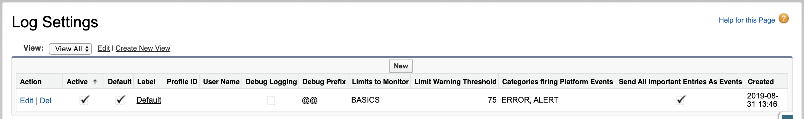

## Debugging & Logging Framework

This logging class allows you to log anything you need to trace through a transaction. This framework provides insight to limits and the current state, and emits this as a Platform Event and/or in the Debug Log.

Behaviours for logs can be configured at the Profile, User or Default level, allowing you a huge amount of flexibility.

Common uses:
- fix debug statements in places you wish to check code flow through the whole application 
- generate platform events that are listened to by Process Builder so that when...
  - your solution encounters an event or error and should chatter the sys admin, business architect or other developers attentionhttps://github.com/c4tch/ApexLoggingFramework.git
  - an event occurrs that you want to commit to a permanent log object for reporting

System.Debug may still be used when developing but should be removed and replaced with c_Log or (ideally) removed entirely after passing QA as these inflate debug logs and slow down performance!

## The Log

c_Log is the main logging class and provides a Logging framework to write out debug logs, monitors limits and publishes log entries as Platform Events and debug statements. Options are driven by Custom MetaData *c_LogSetting__mtd*.

Custom metadata define how we log with a *default* setting or by *username* / *profileid*
 - Generate platform events when a log entry of speciffic cateogory is added, or when important (default false)
 - Create Debug statements (default false) with a defined Debug prefix (default @@)
 - Choose which limit to monitor and set a Limit warning threshold (default 75%)

By default, the debug logging should be off, and only important events or ERRORS or ALERTS should be sent a platform events.

Push a log to the stack using c_Log.push(...lots of options...), and it will get recorded with your preferences and if choosen a debug statement will be outputted.

If you wish a platform event to be sent, then use c_Log.emit();

If you wish to clear the log stack call c_Log.reset(); or c_log.flush() to get the logged data returned as JSON;

Debug log using the logging framework with limits set as BASICS (Cpu and DML):

<<image>>

A platform event sent to c_Log__e will be generated.

Recommendation is to have only ‘Important’ events sent to platform events. For production, it’s best to deactivate the logging completely by default, no debug, no events etc. and only have events generated for a specific use cases and even users ex. integration users that you would like to attach to process builders or other alerting mechanisms.

## Usage

    c_log.push([logCategory], logMessage, [important])); // Push a log entry to the stack
    c_log.emit(); // To have the current set of logs published.ApexPages
    c_log.flush(); // Returns events as JSON and clears the current log

To react to events, (ex. email an admin or store the event), have a Process Builder workflow subscribed to the event, that will email / react to the issue.

## Options
### Debugging

* Debug Prefix - make it easier to find your debug statements, default is ‘@@’
* Debug Logging - turn off saves on CPU and log size, use only for debugging

### Firing Platform events

* Categories firing Platform Events - provide a CSV list of EVENT, ERROR, INTEGRATION, DATABASE, PROCESS, ALERT, OTHER
* Send All Important Entries As Events - will raise a PE for any log marked with IMPORTANT as true, regardless of category.

### Monitoring limits
Logs can be used to only fire when limits are being threatened, by defining the limit threshold and the limits to monitor at the point of calling the log.

* Limit Warning Threshold
* Limits to Monitor - choose BASICS or a CSV list of APEX, CALLOUTS, DATABASE. 
    * BASICS covers CpuTime and DML,
    * APEX provides coverage of detailed apex limits such as Queueable Jobs, Heapsize and CpuTime
    * CALLOUTS shows callouts and async call limits
    * DATABASE covers Soql queries, DML statements, DML Rows, Queries, QueryRows, and Aggregate Queries

